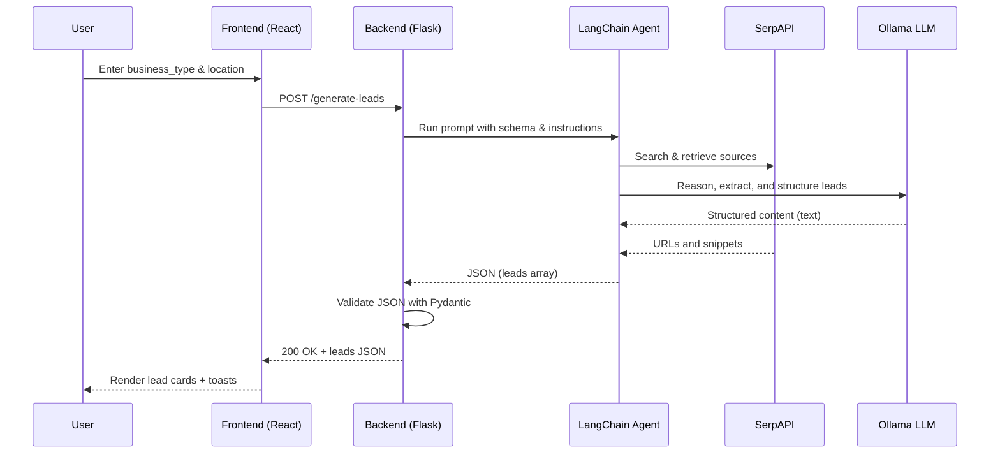

## Lead Agent – AI-Powered Business Lead Generator

Generate verified, high-quality business leads with confidence scoring and source attribution. This project combines a Flask backend (LangChain + Ollama + SerpAPI) with a modern Vite + React + TypeScript frontend.

### Key features
- Verified lead data: name, address, phone, website
- Confidence scoring: High / Medium / Low
- Source attribution: authoritative URL per lead
- JSON schema validation with Pydantic
- Beautiful UI built with shadcn/ui + Tailwind CSS

## Architecture
The system consists of a frontend SPA that calls a Flask API. The API orchestrates a LangChain agent using an Ollama LLM and SerpAPI for web search.

```mermaid
graph TD
  A[User] --> B[Frontend (Vite + React)]
  B -->|POST /generate-leads| C[Flask API]
  C --> D[LangChain Agent]
  D --> E[SerpAPI Search]
  D --> F[Ollama (Local LLM)]
  D -->|JSON leads| C
  C -->|JSON leads| B
  B -->|Render cards| A
```

### Request flow (detailed)


## Tech stack
- Backend: Flask, LangChain, langchain-community, Ollama, SerpAPI, Pydantic, python-dotenv
- Frontend: Vite, React, TypeScript, shadcn/ui, Tailwind CSS

## Prerequisites
- Python 3.10+
- Node.js 18+ (or Bun)
- Git
- Ollama app installed and running (`https://ollama.com/download`)
- SerpAPI API key (`https://serpapi.com/`)

## Getting started

### 1) Clone and open the project
```bash
git clone <this-repo-url>
cd "D:/Python Projects/Lead Agent"
```

### 2) Backend setup (Flask)
```powershell
# In project root
py -m venv .venv
.\.venv\Scripts\Activate.ps1
py -m pip install --upgrade pip
py -m pip install -r requirements.txt

# Environment (create .env in project root)
Copy-Item .env.example .env
# Then edit .env to set SERPAPI_API_KEY and optional OLLAMA_MODEL (default: llama2)

# Ensure the Ollama model is available
ollama pull llama2

# Run the API
py app.py
# Server: http://localhost:5000  | Health: http://localhost:5000/health
```

Environment variables (root `.env`):
- `SERPAPI_API_KEY`=your-key-here
- `OLLAMA_MODEL`=llama2 (or your preferred local model)

### 3) Frontend setup (Vite + React)
```powershell
cd frontend
npm i   # or: bun install

# Environment (optional)
Copy-Item .env.example .env
# VITE_API_BASE_URL defaults to http://localhost:5000

# Start dev server
npm run dev   # or: bun dev
# Typically at http://localhost:5173
```

## Usage
1. Start the backend (Flask) on port 5000
2. Start the frontend (Vite) on port 5173
3. In the UI, enter a business type and location, then click “Generate Leads”

The frontend will call `POST /generate-leads` with a JSON body like:
```json
{
  "business_type": "plumbers",
  "location": "Austin, TX"
}
```

The backend will respond with:
```json
{
  "leads": [
    {
      "name": "...",
      "address": "...",
      "phone": "...",
      "website": "...",
      "confidence_score": "High",
      "source": "https://..."
    }
  ]
}
```

## API
### POST /generate-leads
- Body: `{ business_type: string, location: string }`
- Success: `200 OK` with `LeadList` JSON
- Errors:
  - `400` invalid payload or missing fields
  - `502` agent returned invalid/non-JSON data
  - `503` agent not initialized (likely missing env vars)
  - `500` unexpected server error

### GET /health
- Returns `{ status: "ok", agent_ready: boolean }`

## Configuration
- Frontend reads `VITE_API_BASE_URL` from `frontend/.env`
- Backend reads `SERPAPI_API_KEY` and `OLLAMA_MODEL` from root `.env`
- CORS is enabled on the backend for development

## Troubleshooting
- 503 Agent not initialized:
  - Ensure `.env` has `SERPAPI_API_KEY` and the Ollama app is running
  - Pull your model: `ollama pull llama2` (or set `OLLAMA_MODEL` accordingly)
- 502 Non-JSON response:
  - The LLM may have produced prose. Try again, or swap to a more reliable local model
- Lint/type errors (frontend): `npm run lint`
- Node version issues: use Node 18+ (Vite 5 requirement)

## Development scripts
Backend:
```powershell
py app.py
```

Frontend:
```bash
npm run dev
npm run build
npm run preview
```

## Security notes
- Do not commit your real `SERPAPI_API_KEY`
- Treat the backend as untrusted input surface; consider rate limiting and auth for production

## License
MIT

## Acknowledgements
- LangChain and langchain-community
- Ollama team for local LLMs
- SerpAPI for search integration
- shadcn/ui and Tailwind for the frontend UI foundation


